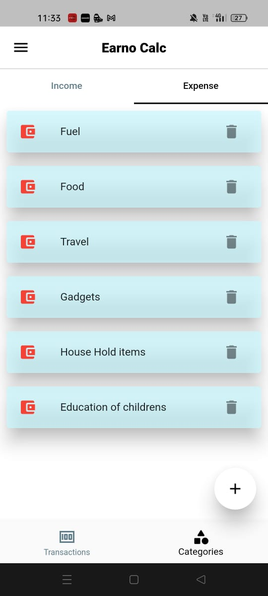

# **Earno Calc**


<div align="center">
  
</div>

Earno_calc is an app to help people  manage their finances, by keeping track of your transactions, here.
You can feed in the purpose, the amt , the date of transaction and category of transaction (for efficient management).
Likewise, you can also add your income
The list of all your expenses and income will be displayed here
you can also customise the category of transaction.

You can sign in to the app, and create your own profile or use as guest
<h3>Features</h3>

- User can Income Category
- User can Expense Category
- User can each transaction by describing purpose,date,amount,category type,category
- Show Red icon on list for expense transactions.
- Show Green icon on list for income transactions.

##Team Members
1. [Muhammed](https://github.com/mdthegamer)
2. [Sufail Sha](https://github.com/SUFAILSHA5009)

## Team Id
Flutter / 41

## Link to product walkthrough
[Code Explanation + Demo](https://drive.google.com/file/d/1T_HTkQAixqptdfdiOMTmu0kcKrOn5y30/view)

## How it Works ?
1. From a TextField widget - Add Income Category

2.From a Textfield widget - Add Expense Category

3.User can each transaction by describing purpose,date,amount,category type,category

4. All the data are stored in a local database called Hive

5.Stateful widgets and Notify Listener widgets are used for dynamic data transfer 


## Packages Used

- hive: [2.0.6](https://pub.dev/packages/hive)
- hive_flutter: [1.1.0](https://pub.dev/packages/hive_flutter)
- hive_generator: [1.1.2](https://pub.dev/packages/hive_generator)
- intl: [0.17.0](https://pub.dev/packages/intl)
- flutter_slidable: [1.2.0](https://pub.dev/packages/flutter_slidable)

## How to configure
Step 1:
```
git clone https://github.com/mdthegamer/Earno-Calc
```

Step 2: (Do install the latest [flutter](https://docs.flutter.dev/get-started/install) version in your PC/Laptop then)
```
flutter pub get
```


## How to Run

After configuration run the following command with your device connected on

```
flutter run --no-sound-null-safety
```
(First, you should read through the guide to [understand unsound null safety.](https://dart.dev/null-safety/unsound-null-safety) If you are sure that you want to run your application with unsound null safety, you can use the following command:)
You can download it here (https://drive.google.com/drive/folders/1Cb_3nJWqyqaztFK_Dee9xQP132PUpcf6?usp=sharing)
## Screenshots
      
  
  
      
